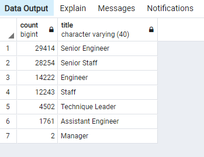
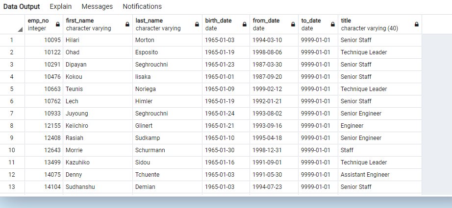

# Pewlett-Hackard-Analysis

## Overview

Our purpose with this analysis is to : determine the number of retiring employees per title, and identify employees who are eligible to participate in a mentorship program.
This is also known as te "silver trunami".

## Results

   - We got the name of employees that retiring by using a  `` DISTINCT COUNT `` on the emp_no to get most recent job title.
    -  To expand on which roles retirements, we got the total count.
    
 
   - From the image above the most jobs with people that are retiring are Senior Engineer and Senior Staff, which comes at no suprise. The more you get promoted the more you have been working in that role.
    
   - 
    
   - In regards to the mentorship, Senior Staff has the best potential for eligbility. As they have the most elder employees.
   
   

## Summary

- How many roles will need to be filled as the "silver tsunami" begins to make an impact?
    - A total number of 90,398 jobs will need to filled.
    - The top two being Senior Engineering and Senior Staff.

- Are there enough qualified, retirement-ready employees in the departments to mentor the next generation of Pewlett Hackard employees?
    - With only a total of 1549 of retirees elgible for mentorship program, there is not enough to mentor the next generation. 
    
- Two Possible additional queires or tables:
    -
